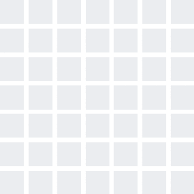

<!--
<h2 align="center">
  Welcome to Amarendra World!
  
</h2>
-->

<!--

  

 -->

<!-- Intro  -->
<h3 align="center">
        <samp>&gt; Hey There!, I am
                <b><a target="_blank" href="https://amarendrashendkar.tech">Amarendra Shendkar</a></b>
        </samp>
</h3>

 
  <samp>
    <a href="https://www.google.com/search?q=Amarendra+Shendkar">「 Google Me 」</a>
     
    「 I am a full stack web appplication developer from India 」
     
     
  </samp>

 
 
<!--   -->
 
  
<!--    -->

 

<!-- About Section -->
 # About me
 

 
  
 ✌️ &emsp; Full Stack Web Developer | B.Tech in CSE @ IIIT Pune.   
 ❤️ &emsp; I love learning new technologies and finding out of the box applications for the ones I know   
 📧 &emsp; Reach me anytime: amarendrashendkar@gmail.com  
 💬 &emsp; Ask me about anything [here](https://github.com/SenorLancelot/SenorLancelot/issues)

 
 
 

## Use To Code

 

## Top Repositories -

  

 

 

  

  

<a> 
    
  
   
</a>

